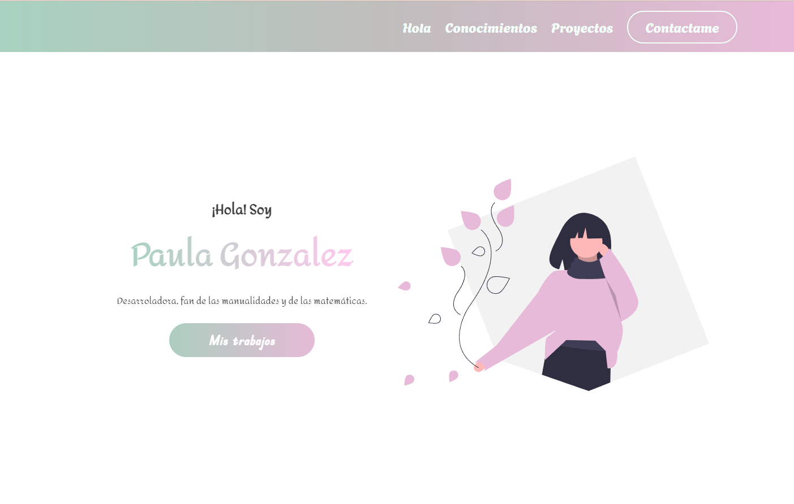
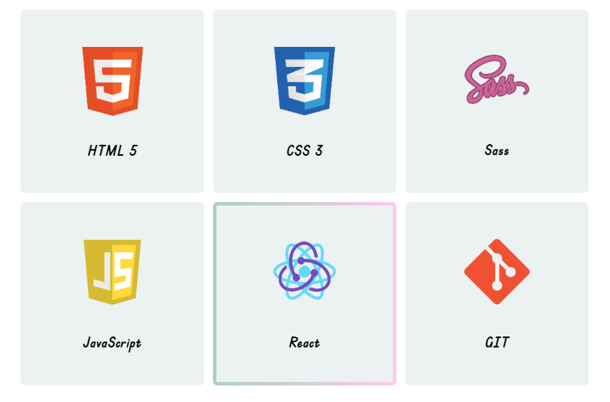
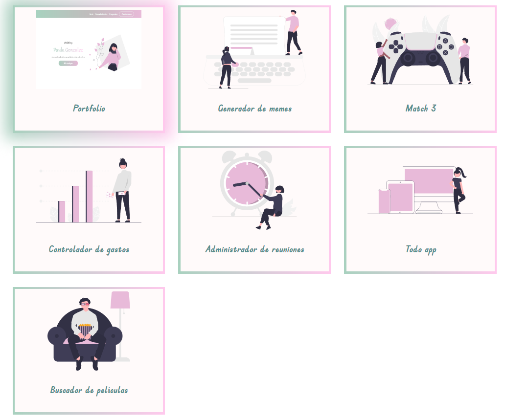
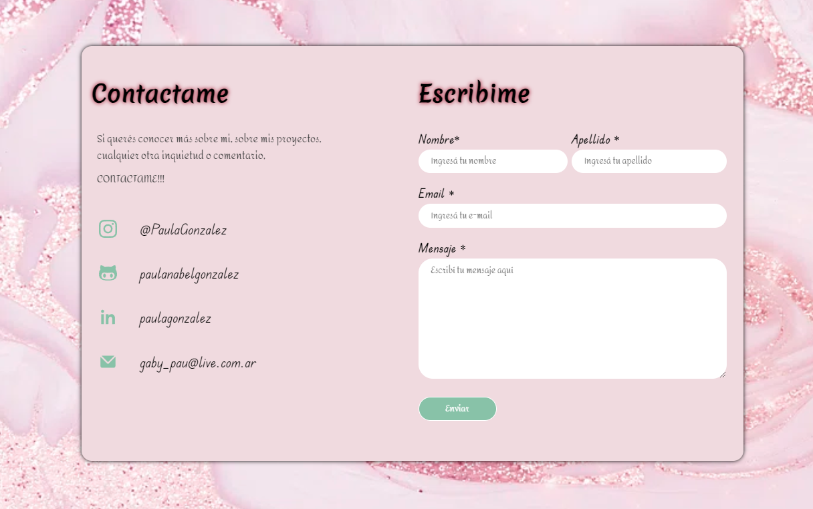

 # Portfolio

 Este es mi primer proyecto de diseño Front-end para la carrera en "ADA ITW", esta diseñado totalmente en html y css.

 

Cuenta con varias secciones, todas con animaciones.

## secciones:

**Mis Conocimientos:**

En esta sección se ve el hover, al pasar por las cards de los conocimientos que iremos adquiriendo a lo largo del curso.

**Mis Proyectos:**

Acá se muestra la animación en las cards acompañada de un filter blur y de una sombra en degrade.

**Contactame:**

En esta parte del formulario es completamente funcional.

         si me podes mandar un mail!!! 

  En resumen es un proyecto basado en la animación y tambien tiene como objetivo la accesibilidad.
  Estoy muy conforme con el resultado, y espero que a ustedes tambien les agrade.   
       